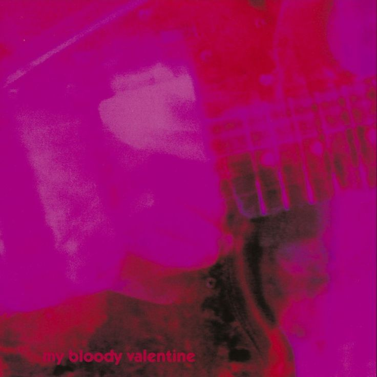

  

  
  
  
  

<h2 align="center">🌫️ About Me</h2>

Yoww, wazzup everyone! My name is Muhammad Azzam Aulawy, but most people know me as **Azzam** or **NotAndrew67**. I'm from Kudus, Central Java, a city where I began my journey in technology and software development.

Currently, I'm studying at **Raden Umar Said Vocational High School** as an 11th-grade student in the **Software Engineering & Game Development** program.

I'm passionate about becoming a **Full-Stack Software Developer**, with a growing interest in both **web and mobile application development**. Right now, I'm actively learning technologies such as **Dart, Java, JavaScript, HTML, and CSS**, while building projects to strengthen my understanding of software engineering principles and problem-solving.

Beyond coding, music is a big part of my life. I enjoy listening to music while programming, especially bands with atmospheric and layered guitar sounds like **My Bloody Valentine**. I also spend time learning drums and guitar, which helps me develop creativity, consistency, and discipline.

My goal is to continuously improve my technical skills, create impactful applications, and pursue a career as a software engineer who can build solutions across multiple platforms.

 

<h2 align="center">⚙️ Technologies & Tools</h2>

<h3 align="center">💻 Programming Languages</h3>

  
  
  

<h3 align="center">🌐 Web Development</h3>

  
  
  
  

<h3 align="center">📱 Mobile Development</h3>

  
  

<h3 align="center">🗄️ Database</h3>

  
  

<h3 align="center">🛠️ Tools & Environment</h3>

  
  
  
  
  
  

<h2 align="center">📊 Statistics</h2>

  
  

 

  
    
  

 

  

 

  

