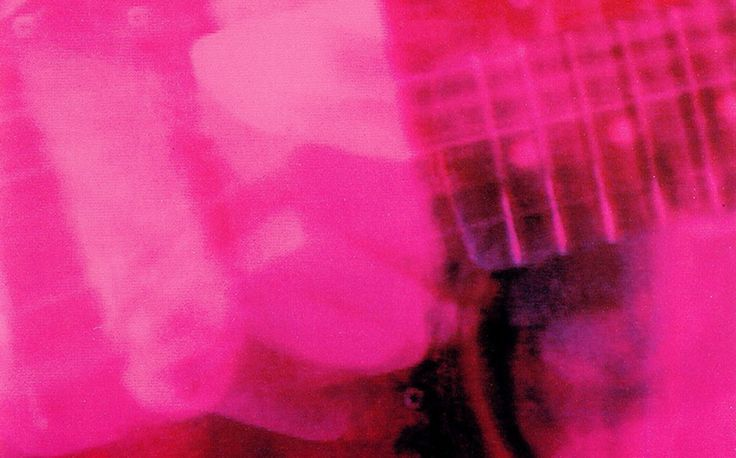
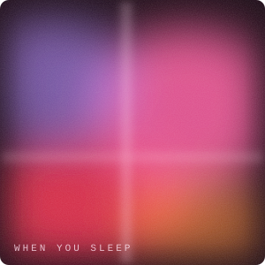

  

  
  
  
  

<h2 align="center">🌫️ About Me</h2>

Yoo, wassup! Gue **Azzam** a.k.a **NotAndrew67**.

Pelajar jurusan programming yang lagi belajar berbagai bahasa pemrograman: Dart, Java, HTML, CSS, sama JavaScript. Masih tahap nyoba-nyoba dan banyak error, tapi lumayan seru.

Di luar ngoding, gue suka banget dengerin musik. Biasanya muter lagu sambil nulis kode, apalagi yang gitarnya berlapis dan agak buram kayak My Bloody Valentine. Kalau lo suka musik juga, sini ngobrol.

 

<h2 align="center">🎧 Now Playing</h2>

  
   
  <i>klik buat dengerin · best listened to loud</i>

<h2 align="center">⚙️ Technologies</h2>

  
  
  
  
  

  
  
  
  
  

<h2 align="center">📊 Statistics</h2>

  
  

 

  
    
  

 

  

 

  

